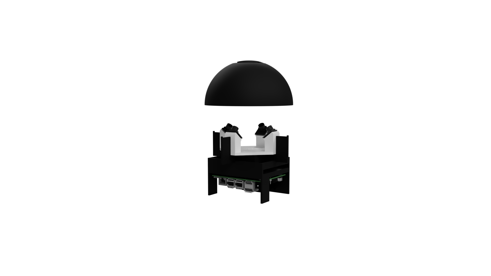
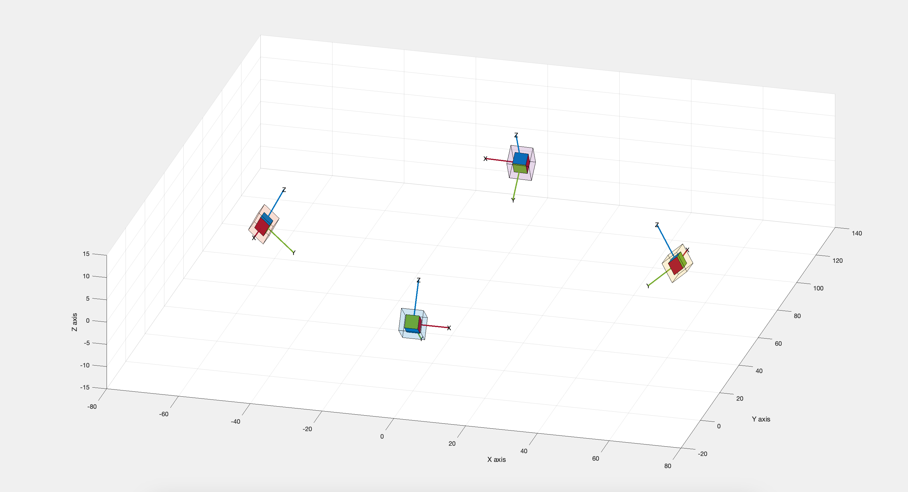

### Micro-Scale tracking of surgical instrument
This GitHub repository hosts a tool designed for tracking color-coded surgical instruments and performing 3D pose estimation. Built to meet the demands of modern microsurgical environments, this tool seamlessly integrates with quad-cam camera setups, processing four input videos simultaneously.

### System description
For our project, we are using the Arducam 1MP*4 Quadrascopic Camera Bundle Kit linked to a single MIPI socket in a Nvidia Jetson Nano. The four cameras are mounted on stands with a tilt of 40º around the camera's x-axis.

We designed and integrated a custom case and lighting system for protection and reliability purposes. Also, we integrated a dome to be placed on top of the cameras to make color detection more stable.

- [3D Model](model_case.stl)


#### How does it work ?

* Instanciate the cameras and start the recording, and the video capturers
* Calibrate for intrinsic and extrinsic parameters
* Instanciate the detector of the instrument `src/detector_red.py`
* Instanciate the reconstructor `src/reconstructor.py`
* Detect and reconstruct to get the points in 3d

To run this pipeline :
`python main.py`


#### How to use the QuadCam
The class `src/quadcam.py` provides a high level interacation with the cameras. 
A basic pipeline of the use would be the following 
```python
quadcam = QuadCam()
quadcam.open_cameras() # starts the capturing instances
# start the video capturing streams to save the video. attribute -> outs
quadcam.init_video_writers(dir_name) 
# reads the current scene and stores it in the attribute curr_frames
quadcam.read()
```
The attribute `quadcam.curr_frames` is a list in the form [frame_cam0, frame_cam1, frame_cam2, frame_cam3]

#### Calibration

Calibration allows us to find the projection matrices for the cameras that would be later used for triangulation. To calibrate the cameras first run the script `calibrate.py` to prepare the calibration images or import calibration images.
If you are importing calibration images the format of the directory should be the following
```
./
    ./
    solo/
        ./
        camera0/...
        camera1/...
        camera2/...
        camera3/...
    synched/
        camera01/...
        camera02/...
        camera03/...
        camera12/...
        camera13/...
        camera23/...
```
Then to calibrate the cameras:
* intirinsic : `quadcam.solo_calibrate_cameras()`
* extrinsic : `quadcam.stereo_calibrate_cameras()`

For a full calibration of the camera 
`python quadcam.full_calibrate_cameras(calib_dir)`

To save the calibration parameters
`python quadcam.save_calibration("calibpath.pickle")`

to load the calibration parameters
`python quadcam.load_calibration("calibpath.pickle")`

#### Final Calibration
Proper calibration is crucial for accurate 3D pose estimation. After experimenting with the mentioned methods without obtaining good results, we found success with Matlab's calibration tools. Here's our approach:

1. **Mono Calibration:** Each individual camera undergoes mono calibration to obtain intrinsic parameters.
2. **Stereo Calibration:** Using Matlab's stereo calibration tool, we estimate the pose of each camera pair in the camera_0 coordinate frame.
3. **Camera_3 Position Estimation:** Due to challenges in synchronizing images, we algebraically derived the transformation for camera_3 using stereo pairs 1-3 and 2-3.

Our calibration process yielded feasible results for the acquisition system used, with reprojection errors consistently below 0.3 for mono calibrations and below 0.6 for stereo calibrations. Further processing was undertaken to visualize camera poses accurately, compensating for the rotational adjustments.

The complete calibration dataset and results can be found in the following folders:

- [calibration_images_final](data/calibration_images_final)
- [calibration](final_calibration)




#### Instrument Detection

At the current state of the module we detect red points

#### Reconstruction

We triangulate to get the 3D point
