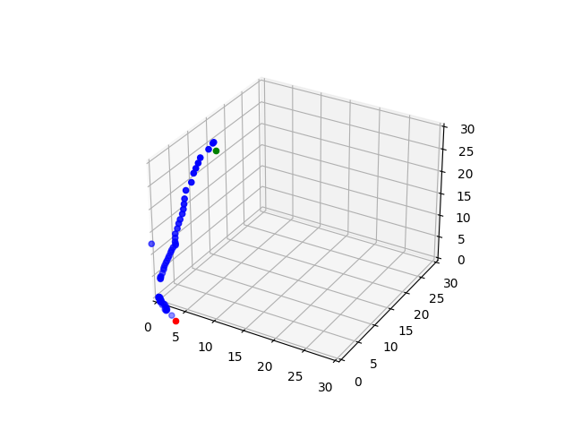

### Micro-Scale tracking of surgical instrument

The goal of the module is to track in real time the position of a surgical instrument using a video capturing device. In our case we use 4 Arducam cameras linked to a single MIPI socket in a jetson Nano


#### How does it work ?

* Instanciate the cameras and start the recording, and the video capturers
* Calibrate for intrinsic and extrinsic parameters
* Instanciate the detector of the instrument `src/detector_red.py`
* Instanciate the reconstructor `src/reconstructor.py`
* Detect and reconstruct to get the points in 3d

To run this pipeline :
`python main.py`



#### How to use the QuadCam
The class `src/quadcam.py` provides a high level interacation with the cameras. 
A basic pipeline of the use would be the following 
```python
quadcam = QuadCam()
quadcam.open_cameras() # starts the capturing instances
# start the video capturing streams to save the video. attribute -> outs
quadcam.init_video_writers(dir_name) 
# reads the current scene and stores it in the attribute curr_frames
quadcam.read()
```
The attribute `quadcam.curr_frames` is a list in the form [frame_cam0, frame_cam1, frame_cam2, frame_cam3]

#### Calibration

Calibration allows us to find the projection matrices for the cameras that would be later used for triangulation. To calibrate the cameras first run the script `calibrate.py` to prepare the calibration images or import calibration images.
If you are importing calibration images the format of the directory should be the following
```
./
    ./
    solo/
        ./
        camera0/...
        camera1/...
        camera2/...
        camera3/...
    synched/
        camera01/...
        camera02/...
        camera03/...
        camera12/...
        camera13/...
        camera23/...
```
Then to calibrate the cameras:
* intirinsic : `quadcam.solo_calibrate_cameras()`
* extrinsic : `quadcam.stereo_calibrate_cameras()`


#### Instrument Detection

At the current state of the module we detect red points

#### Reconstruction

We triangulate to get the 3D point

